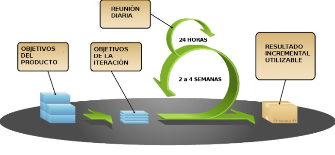

## Apuntes tema 1

#### Tipos de Software:  
De sistema (S.O., drivers, etc.)  
De aplicación (Suites ofimáticas, navegadores, edición de imágenes, etc.)  
De desarrollo (Editores, compiladores, intérpretes, etc.)  

####  Relación Hardware-Software  
Disco duro: almacena de forma permanente los archivos ejecutables y los archivos de datos.  
Memoria RAM: almacena de forma temporal el código binario de los archivos ejecutables y los archivos de datos necesarios.  
CPU: lee y ejecuta instrucciones almacenadas en memoria RAM, así como los datos necesarios.  
E/S: recoge nuevos datos desde la entrada, se muestran los resultados, se leen/guardan a disco, etc.  

#### Códigos fuente, objeto y ejecutable  
Código fuente: archivo de texto legible escrito en un lenguaje de programación.  
Código objeto (intermedio): archivo binario no ejecutable.  
Código ejecutable: archivo binario ejecutable.  

#### Ingeniería de software:  
Disciplina que estudia los principios y metodologías para el desarrollo y mantenimiento de sistemas software.

#### Desarrollo de software  
Fases principales:
- ANÁLISIS: Se determina y define claramente las necesidades del cliente y se especifican los requisitos que debe cumplir el software a desarrollar.
- DISEÑO: Se descompone y organiza el sistema en elementos componentes que pueden ser desarrollados por separado.
- CODIFICACIÓN: Se escribe el código fuente de cada componente.
- PRUEBAS: El principal objetivo de las pruebas debe ser conseguir que el programa funcione incorrectamente y que se descubran defectos.
- MANTENIMIENTO: Durante la explotación del sistema software es necesario realizar cambios ocasionales. Para ello hay que rehacer parte del trabajo realizado en las fases previas.  

#### Resultado tras cada fase (I)
- Ingeniería de sistemas: Especificación del sistema
- ANÁLISIS: Especificación de requisitos del software
- DISENO arquitectónico: Documento de arquitectura del software
- DISENO detallado: Especificación de módulos y funciones
- CODIFICACIÓN: Código fuente

#### Resultado tras cada fase (II)
- PRUEBAS de unidades: Módulos utilizables
- PRUEBAS de integración: Sistema utilizable
- PRUEBAS del sistema: Sistema aceptado
- Documentación: Documentación técnica y de usuario
- MANTENIMIENTO: Informes de errores y control de cambios

#### Modelos de desarrollo de software
Modelos clásicos (predictivos)
- Modelo en cascada 
- Modelo en V 
Modelo de construcción de prototipos 
Modelos evolutivos o incrementales
- Modelo en espiral (iterativos) 
- Metodologías ágiles (adaptativos)

Scrum (II)

#### XP (Programación extrema) (I)
##### Valores
- Simplicidad
- Comunicación
- Retroalimentación
- Valentía o coraje
- Respeto o humildad

#### XP (Programación extrema) (II)
##### Características
- Diseño sencillo
- Pequeñas mejoras continuas
- Pruebas y refactorización
- Integración continua
- Programación por parejas
- El cliente se integra en el equipo de desarrollo
- Propiedad del código compartida
- Estándares de codificación
- 40 horas semanales

#### Tipos de lenguajes declarativos:
- Lógicos: Utilizan reglas. Ej: Prolog
- Funcionales: Utilizan funciones. Ej: Lisp, Haskell
- Algebraicos: Utilizan sentencias. Ej: SQL
  -Normalmente son lenguajes interpretados.
* Los lenguajes declarativos son poco usados en la actualidad *

#### Tipos de lenguajes imperativos:
- Estructurados: C
- Orientados a objetos: Java
- Multiparadigma: C++, Javascript
  -Los lenguajes orientados a objetos son también lenguajes estructurados.
  -Muchos de estos lenguajes son compilados.

#### Tipos de lenguajes según nivel de abstracción: 
- Bajo nivel: ensamblador
- Medio nivel: C
- Alto nivel: C++, Java

#### Evolución
- Código binario
- Ensamblador
- Lenguajes estructurados
- Lenguajes orientados a objetos

#### Criterios para la selección de un lenguaje
- Campo de aplicación
- Experiencia previa
- Herramientas de desarrollo
- Documentación disponible
- Base de usuarios
- Reusabilidad
- Transportabilidad
- Imposición del cliente
